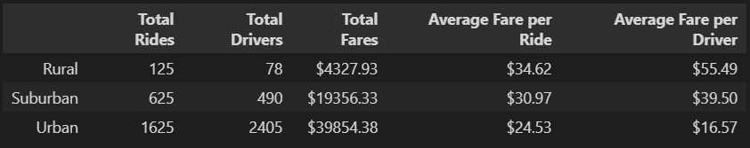

# Pyber Analysis
##### Module 5 Challenge UofT SCS
##### by: Miguel Fidelino

Overview of the analysis

We are requested to create a summary DataFrame of the ride-sharing data by city type using Pandas and Matplotlib. We then present our sorted data to the decision-makers at PyBer to help them make an informed decision.

### __Results__

The chart above states that Rural areas produce the least amount of revenue, and Urban areas produce the highest amount of revenue. The following information below will extrapolate on the data.

Income generated from rural areas have the highest averages per ride and driver. Rural areas have 1.6 rides per driver. 

Suburban areas observe a lower rides-per-driver ratio of 1.27 rides per driver.

Urban areas observe the lowest ratio of .68 rides-per-driver. This area experiences the lowest average fare per ride, and lowest average fare per driver. 

As the PyBer Summary by City Type table shows, the closer you are to more populated areas, the driver generates less revenue. However, urban areas generate more the most income for PyBer as seen in the chart below:

Urban areas tend to make esimated $2,200 USD, while Suburban and Rural areas make estimated $1000 USD and $300 USD respectively. The amount of revenue generated by Urban areas almost double that of Suburban and Rural areas combined.

### __Summary__

From the data we have analyzed, I recommend a few things to consider to help lessen the disparities between the three city types:

    1. Boost the amount of drivers in Rural and Suburban areas. 
    It appears that the number of drivers in the area affects the revenue generated.
    
    2. Optimize the amount of drivers in Urban areas to approach a rides-per-driver ratio of 1. 
    Having more drivers in an unsaturated market, such as in the Suburban areas, 
    can boost the averages seen in "PyBer Summary by City Type".
    
    3. Provide customers in Rural areas promotional offers to 
    increase the popularity and usage of PyBer services.

